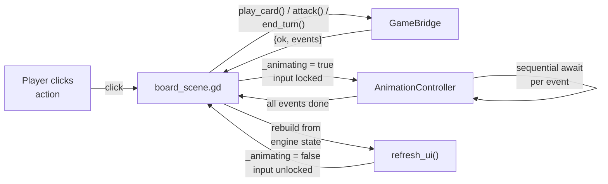
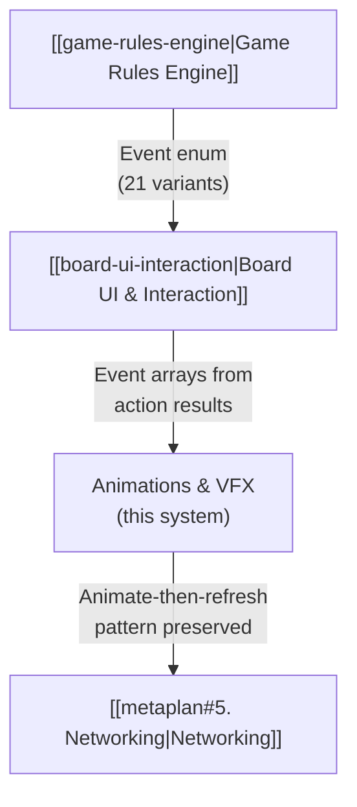

# Animations & VFX

> [!info] System Status
> This system is **complete**. No Rust changes were needed — all work is GDScript + scene files. See [[metaplan#4. Animations & VFX (Godot)]] for the original scope.

## Overview

System 4 adds visual feedback to the board UI ([[board-ui-interaction|System 3]]). Previously, every action called `refresh_ui()` which cleared and rebuilt the entire scene tree instantly. The 21 event types returned by `GameBridge` were ignored.

Now, actions follow an **animate-then-refresh** pattern: events are played as sequential tweened animations on the existing pre-action nodes, then `refresh_ui()` rebuilds everything from the engine's authoritative state for a clean final sync.

The scope covers: attack lunges, damage numbers, death fades, summon bounces, card play/draw animations, spell flash, turn banners, hero damage shake, fatigue, card burn, divine shield pop, weapon equip/destroy flash, and an interaction lock during animation.



## Design Decisions

### Animate-Then-Refresh over Incremental Updates

Each animation handler tweens pre-action nodes (or spawns temporary ones for create-events). After all animations, `refresh_ui()` wipes and rebuilds from the engine's authoritative state. This makes every animation handler fire-and-forget — even if an animation leaves the scene tree slightly wrong (stale modulate, wrong position), the final rebuild corrects it. No desync is possible.

### Sequential Await per Event

Events are processed one at a time in order: `for event in events: await _dispatch_event(event, ...)`. The engine already emits events in the correct causal order (e.g., `attack_performed` → `damage_dealt` → `minion_died` → deathrattle events), so sequential `await` naturally produces correct visual choreography without an explicit priority/ordering system.

### Pre-Action Player Mapping

The engine state has already changed by the time animations start (e.g., after `end_turn()`, the active player has flipped). But the scene tree still shows the pre-action layout. A `pre_action_player` int is passed through to map event player IDs to the correct scene nodes:

- `event.player == pre_action_player` → `player_board`, `player_hand`, `player_hero`
- `event.player != pre_action_player` → `opponent_board`, `opponent_hand`, `opponent_hero`

For entity-based lookups (damage, death, divine shield), `_find_node()` searches all containers by `entity_id` without needing the player mapping.

### RefCounted AnimationController

`AnimationController` extends `RefCounted` (default), not `Node`. It holds references to the board scene and animation layer, and creates tweens via `_board.create_tween()`. This keeps it out of the scene tree — no lifecycle management, no `_process`, just a callable object stored in a variable on `board_scene.gd`.

### CanvasLayer for Overlays

Floating damage numbers, turn banners, and spell flash overlays are added to an `AnimationLayer` (CanvasLayer, layer 1), rendering above the board's default layer 0. This prevents them from being clipped by containers or occluded by board nodes. Since there's no camera, `global_position` in the main tree equals screen position in the CanvasLayer.

### Create-Then-Animate Events

Some events reference entities that don't yet exist as scene nodes:

| Event | Strategy |
|-------|----------|
| `minion_summoned` | Fetch data from `Game.get_board(player)`, instantiate `BoardMinion`, insert into container, animate scale from zero |
| `card_drawn` | Fetch data from `Game.get_hand(player)`, instantiate `HandCard` / `FaceDownCard`, add to hand container, animate scale from zero |
| `card_played` | Find existing `HandCard` by `hand_index`, animate shrink + fade, then remove from tree |

These mutate the scene tree during animation — safe because `refresh_ui()` replaces everything afterward.

## Architecture

### Event → Animation Mapping

| Event | Animation | Duration |
|-------|-----------|----------|
| `attack_performed` | Attacker lunges 70% toward defender, bounces back | 0.4s |
| `damage_dealt` | Floating "−N" label + red flash on target | 0.5s |
| `hero_damaged` | Hero panel shake + floating damage number | 0.5s |
| `divine_shield_popped` | Yellow flash on minion | 0.35s |
| `minion_died` | Fade out + scale to 0.8, removed from tree | 0.4s |
| `minion_summoned` | Insert node, scale 0 → 1.15 → 1.0 (bounce) | 0.35s |
| `card_played` | Hand card shrinks + fades, removed from tree | 0.3s |
| `card_drawn` | Card scales in from zero | 0.3s |
| `spell_cast` | Screen-wide white flash (ColorRect on CanvasLayer, fade out) | 0.3s |
| `turn_started` | Banner "Your Turn" / "Enemy Turn" slides in from left, holds, fades | 0.8s |
| `hero_died` | Intense red flash + shake on hero panel | 0.6s |
| `card_burned` | "Burned!" floating text near hero | 0.4s |
| `fatigue_damage` | Hero shake + "Fatigue! −N" floating text | 0.4s |
| `weapon_equipped` | Yellow-white flash on hero panel | 0.3s |
| `weapon_destroyed` | Yellow-white flash on hero panel | 0.3s |
| `mana_spent` | Mana label updated inline (no delay) | 0 |
| Others (`mana_refilled`, `mana_gained`, `turn_ended`, `game_started`, `game_over`) | Pass-through (no-op) | 0 |

### Event Ordering (Engine-Deterministic)

The engine emits events in causal order. Key sequences:

**Attack:** `attack_performed` → `damage_dealt` (defender) → `damage_dealt` (attacker) → `minion_died` (if any) → deathrattle events

**Card play:** `card_played` → `mana_spent` → `minion_summoned` (or `spell_cast` + `damage_dealt`)

**End turn:** `turn_ended` → `turn_started` → `mana_gained` → `mana_refilled` → `card_drawn`

### Interaction Lock

An `_animating` bool on `board_scene.gd` guards all five input entry points:

- `_on_hand_card_clicked`
- `_on_minion_clicked`
- `_on_hero_clicked`
- `_on_end_turn_pressed`
- `_unhandled_input` (right-click / Escape)

The flag is set `true` before the first animation and `false` after the last, preventing re-entrant actions. The End Turn button is also disabled during animation. Since `_animating` is set synchronously before the first `await`, it guards against input from the very first frame of animation.

### Floating Text

`FloatingText` (Label subclass) is a fire-and-forget visual element added to the `AnimationLayer`. It:

1. Sets text, color, font size 28, outline size 3
2. Creates its own tween: float up 60px over `duration`, fade out over the last 40%
3. `queue_free()` on tween completion

Floating text outlives the event that spawned it (0.8s lifetime vs 0.4–0.5s event duration), creating a natural visual trail while subsequent events animate.

### Speed Controls

`AnimationController` exposes two properties:

- `animation_speed: float = 1.0` — all durations divided by this (set to 2.0 for double speed)
- `skip_animations: bool = false` — when true, `play_events()` returns immediately (all events pass through silently, `refresh_ui()` still rebuilds)

### Node Lookup

`_find_node(entity_id)` searches linearly through `player_board`, `opponent_board`, `player_hero`, `opponent_hero`, and `player_hand` (~24 nodes max). Returns `null` if not found. All animation handlers guard against null results and skip gracefully.

## File Inventory

New GDScript files:

| File | Role |
|------|------|
| `godot/scripts/board/animation_controller.gd` | Event queue processor — `play_events()` loop, `_dispatch_event()` routing, 16 `_anim_*` handlers, utility methods |
| `godot/scripts/board/floating_text.gd` | Self-animating Label — floats up, fades out, self-destructs |

New scene:

| File | Purpose |
|------|---------|
| `godot/scenes/board/floating_text.tscn` | Minimal Label scene with script attached |

Modified files:

| File | Changes |
|------|---------|
| `godot/scripts/board/board_scene.gd` | Added `_animating` flag, `_anim_controller` var, `animation_layer` ref, `_play_events()` method, guards on all 5 input handlers, `await` in all 3 action methods (`_play_card_action`, `_attack_action`, `_on_end_turn_pressed`) |
| `godot/scripts/board/hand_card.gd` | Added `_entity_id` field, set from `data.get("entity_id", -1)` in `set_card_data()` |
| `godot/scenes/board/board_scene.tscn` | Added `AnimationLayer` (CanvasLayer) node |

No changes:

| File | Why |
|------|-----|
| `crates/rules/src/*` | Event system already complete from System 2 |
| `crates/gdext-bridge/src/*` | Event serialization already complete from System 3 |

## Scene Hierarchy (Updated)

```
BoardScene (Control)
├── Background (ColorRect)
├── OpponentArea (VBoxContainer)
│   ├── OpponentTopRow → OpponentHero (HeroPanel)
│   ├── OpponentHand (HBoxContainer) ← FaceDownCard instances
│   └── OpponentBoard (HBoxContainer) ← BoardMinion instances
├── CenterRow → TurnLabel, EndTurnButton
├── PlayerArea (VBoxContainer)
│   ├── PlayerBoard (HBoxContainer) ← BoardMinion instances
│   ├── PlayerHand (HBoxContainer) ← HandCard instances
│   └── PlayerBottomRow → PlayerHero (HeroPanel), ManaLabel
├── StatusLabel
├── GameOverPanel
├── DebugPanel
└── AnimationLayer (CanvasLayer)          ← NEW
    └── [dynamic children: FloatingText, banners, flash overlays]
```

## Gotchas

> [!note] Container children and position tweening
> Board minions and hand cards live inside `HBoxContainer`s, which manage child positions. Directly tweening `position` works because the container only re-positions children on explicit layout updates (add/remove children, `queue_sort()`). During a tween, the position is overridden frame-by-frame. After `refresh_ui()` clears and rebuilds, all positions are recomputed cleanly.

> [!note] Pivot offset for scale animations
> `Control` nodes scale from their top-left corner by default. For bounce and shrink animations to look centered, `pivot_offset` is set to `custom_minimum_size * 0.5` (for newly created nodes) or `size * 0.5` (for existing nodes). This must be set before the tween starts.

> [!note] Board re-layout after death
> When a minion node is removed from an `HBoxContainer` (via `remove_child` + `queue_free`), remaining children snap to fill the gap. This is acceptable for v1 — a future polish pass could add a smooth slide animation.

> [!note] Freed nodes and subsequent events
> `_anim_minion_died` removes the node from its parent (via `remove_child`) after the fade animation. Subsequent events referencing that `entity_id` get `null` from `_find_node()` and skip gracefully. Using `remove_child` (not just `queue_free`) ensures the node is immediately invisible to lookups, even within the same frame.

> [!note] Async signal handlers
> Action methods (`_play_card_action`, `_attack_action`, `_on_end_turn_pressed`) are now coroutines (they contain `await`). When called from signal handlers (button pressed, GUI input), the signal handler returns at the first `await`, and the coroutine resumes later when the tween finishes. The `_animating` flag is set synchronously *before* the first `await`, so re-entrant calls are blocked from the very first frame.

> [!note] create_tween() from RefCounted
> `AnimationController` is not a `Node` and cannot call `create_tween()` directly. All tweens are created via `_board.create_tween()`, binding them to the board scene node. If the board scene is freed, all tweens are automatically cancelled.

## Upgrading to Production-Quality VFX

### Current State vs Hearthstone-Quality

The current implementation uses programmatically-created `Panel`/`ColorRect` nodes with `StyleBoxFlat` — essentially colored rectangles and circles. This produces functional but "comic-like" visuals. Real Hearthstone VFX use textured particle systems, bloom/glow post-processing, artist-painted sprite sheets, and custom shaders for distortion and light emission.

This is **not a Godot limitation**. Godot's 2D renderer is fully capable of matching Hearthstone's visual quality. The gap is art assets and VFX artist time, not engine capability.

### Godot's VFX Toolbox

| Tool | Use Case |
|------|----------|
| `GPUParticles2D` | GPU-accelerated particles with textures, sub-emitters, trails, turbulence |
| `CanvasItem shaders` | Glow, distortion, dissolve, color ramp (GLSL-like language) |
| `Light2D` / `PointLight2D` | Dynamic 2D lighting (e.g., fire glow on nearby cards) |
| `WorldEnvironment` + glow | Bloom post-processing |
| `AnimatedSprite2D` | Frame-by-frame VFX from sprite sheets |
| `BackBufferCopy` + shaders | Screen-space distortion (heat haze) |

A production fireball would replace the current `Panel.new()` rects with something like:

```
GPUParticles2D (fire trail — 30 particles, additive blend, fire texture)
├── sub-emitter: smoke particles (soft gray, alpha fade)
├── sub-emitter: spark particles (small bright dots)
GPUParticles2D (explosion — one-shot burst, radial, flame texture)
PointLight2D (orange glow that illuminates nearby board)
Sprite2D + shader (heat distortion on background)
```

Each particle system needs a hand-painted or photographed fire texture, not a solid-color rectangle. That's where the visual quality comes from.

### Game Sounds & Audio Cues

Hearthstone uses layered audio feedback to reinforce every game event — attacks land with meaty impacts, battlecries are voiced lines, deathrattles have eerie tolls, and even card draws have a satisfying "whoosh." Without sound, the best animations feel hollow.

#### Sound Categories

| Category | Trigger Event | Hearthstone Reference | Implementation |
|----------|---------------|----------------------|----------------|
| **Attack impact** | `attack_performed` | Melee slash, weapon clang, or fist thud depending on attacker type | Play at lunge apex (same callback that spawns slash VFX) |
| **Battlecry** | `minion_summoned` (if minion has battlecry) | Voiced line unique to the card ("Charge forward!", "Heh, this guy's toast") | Play after summon bounce animation |
| **Deathrattle** | `minion_died` (if minion has deathrattle) | Bell toll + eerie whisper + card-specific line | Play at start of death fade animation |
| **Spell cast** | `spell_cast` | Arcane whoosh, fire ignition, frost crackle — varies by spell school | Play during spell flash/projectile animation |
| **Card draw** | `card_drawn` | Quick paper slide / whoosh | Play as card scales in |
| **Card play** | `card_played` | Heavier card slam onto the board | Play as hand card shrinks |
| **Minion summon** | `minion_summoned` | Magical materialization sound (sparkle/thud) | Play during scale-up bounce |
| **Minion death** | `minion_died` | Generic death groan or shatter | Play during fade-out |
| **Hero damage** | `hero_damaged` | Armor clank or pain grunt | Play with shake animation |
| **Hero death** | `hero_died` | Dramatic explosion + defeat sting | Play with red flash |
| **Turn start** | `turn_started` | Coin spin / bell chime + "Your turn" voice line | Play with banner slide-in |
| **Divine shield pop** | `divine_shield_popped` | Glass shatter | Play with yellow flash |
| **Taunt** | Visual only (shield border) | Low shield-raise sound on summon | Play if summoned minion has taunt |
| **Fatigue** | `fatigue_damage` | Ominous rumble + pain | Play with hero shake |
| **Card burn** | `card_burned` | Fire crackle + paper ignition | Play with "Burned!" text |
| **Weapon equip** | `weapon_equipped` | Metallic unsheathe / anvil ring | Play with hero flash |

#### Godot's Audio Toolbox

| Node / Class | Use Case |
|-------------|----------|
| `AudioStreamPlayer` | Non-positional audio — UI sounds, music, turn announcements (same volume regardless of screen position) |
| `AudioStreamPlayer2D` | Positional audio — attack impacts, death sounds, spell hits (panned/attenuated by distance from listener) |
| `AudioBus` | Mixing — separate buses for SFX, Music, Voice, UI with independent volume sliders |
| `AudioStream` formats | `.ogg` (OGG Vorbis) for music/loops, `.wav` for short SFX (no decoding latency), `.mp3` supported but `.ogg` preferred in Godot |
| `AudioStreamRandomizer` | Variation — wraps multiple similar clips, randomizes pitch/selection to avoid repetition fatigue |
| `AudioStreamPolyphonic` | Layering — play multiple simultaneous sounds from one player (e.g., impact + grunt + shield break all at once) |

> [!tip] For a card game with a fixed camera, `AudioStreamPlayer` (non-positional) is usually sufficient. Use `AudioStreamPlayer2D` only if you want subtle left-right panning based on board position (e.g., attack on the left side of the board sounds slightly panned left).

#### Implementation Pattern

Sound playback follows the same fire-and-forget pattern as VFX sprites. Add an `_play_sound()` helper to `AnimationController`:

```gdscript
# Preload sound assets
const SFX_ATTACK_SLASH = preload("res://assets/sfx/attack_slash.ogg")
const SFX_CARD_DRAW = preload("res://assets/sfx/card_draw.ogg")
const SFX_MINION_DEATH = preload("res://assets/sfx/minion_death.ogg")
# ... etc

func _play_sound(stream: AudioStream, volume_db: float = 0.0, pitch_variance: float = 0.05) -> void:
    var player = AudioStreamPlayer.new()
    player.stream = stream
    player.volume_db = volume_db
    player.pitch_scale = randf_range(1.0 - pitch_variance, 1.0 + pitch_variance)
    _anim_layer.add_child(player)
    player.play()
    player.finished.connect(player.queue_free)
```

Then call it from existing animation handlers:

```gdscript
func _anim_attack(event: Dictionary) -> void:
    # ... existing lunge code ...
    tw.tween_callback(_play_sound.bind(SFX_ATTACK_SLASH))
    tw.tween_callback(_create_slash_effect.bind(_center_of(defender), direction.angle()))
    # ... existing return code ...
```

> [!note] The `pitch_variance` parameter applies slight random pitch shifting (±5% by default) so repeated attacks don't sound identical. This is a standard game audio technique called "pitch randomization."

#### Per-Card Voice Lines

In Hearthstone, each minion has unique voice lines for summon, attack, and death. To support this in the card data pipeline:

1. **Add sound fields to `CardDef`** (in `card.rs`):

```rust
pub struct CardDef {
    // ... existing fields ...
    pub sfx_summon: Option<String>,    // "res://assets/sfx/cards/fire_elemental_summon.ogg"
    pub sfx_attack: Option<String>,
    pub sfx_death: Option<String>,
}
```

2. **Reference in RON card data**:

```ron
CardDef(
    id: "basic_fire_elemental",
    name: "Fire Elemental",
    // ... existing fields ...
    sfx_summon: Some("cards/fire_elemental_summon"),
    sfx_attack: Some("cards/fire_elemental_attack"),
    sfx_death: Some("cards/fire_elemental_death"),
)
```

3. **Look up via CardDB at animation time** — the animation handler fetches the card's sound path from `CardDB.get_card(card_id)` and loads it dynamically, falling back to a generic sound if no card-specific clip exists.

> [!warning] Voice lines are the most expensive audio asset category — a set of 100 cards with 3 lines each (summon, attack, death) requires 300 recorded clips. For early development, use a single generic sound per event type and add per-card voices incrementally for key cards.

#### Sourcing Sound Assets

| Source | Type | Notes |
|--------|------|-------|
| [Freesound.org](https://freesound.org) | Free (CC) | Huge library of individual SFX — search "sword slash", "magic spell", "card flip" |
| [Sonniss GDC Bundle](https://sonniss.com/gameaudiogdc) | Free | Annual free pack of professional game SFX (thousands of clips) |
| [Kenney.nl](https://kenney.nl/assets?q=audio) | Free (CC0) | Clean, game-ready UI and impact sounds |
| [GameSounds.xyz](https://gamesounds.xyz) | Free (CC0) | Royalty-free game audio library |
| [Epidemic Sound](https://www.epidemicsound.com) | Subscription | Professional music and SFX, game-licensed |
| [PMSFX](https://www.pmsfx.com) | Free/Paid | Cinematic game SFX — magic, impacts, UI |
| **AI generation** | Free | [ElevenLabs](https://elevenlabs.io) or [Bark](https://github.com/suno-ai/bark) for voice lines; [Stable Audio](https://www.stableaudio.com) for SFX |

> [!tip] Start with Kenney's free UI audio pack for card draw/play sounds and Freesound for combat impacts. These get functional audio running in minutes. Replace with higher-quality assets later.

### Sourcing VFX Assets

**Ready-made sprite sheet packs** (recommended for fastest results):

- [itch.io](https://itch.io) — largest source of Godot-compatible VFX. Search "VFX sprite sheet", "fire particles", "2D effects"
- [CraftPix](https://craftpix.net) / [GameDev Market](https://www.gamedevmarket.net) — commercial 2D VFX sprite sheets (fire, explosions, magic)
- [OpenGameArt.org](https://opengameart.org/content/vfx) — free CC-licensed VFX sprite sheets
- Unity Asset Store — many 2D VFX packs are just PNG sprite sheets usable in any engine (check license)

A $10–20 sprite sheet pack typically includes fire, explosions, lightning, healing, and buff effects as ready-to-use assets. This gets 80% of the way to Hearthstone-quality VFX for minimal cost.

**AI-generated VFX** (video-to-sprite-sheet pipeline):

Generate a short fire/explosion clip with an open-source video model, extract frames, pack into a sprite sheet.

| Model | VRAM | Notes |
|-------|------|-------|
| [Wan 2.2](https://github.com/Wan-Video/Wan2.2) (Alibaba) | 8 GB (1.3B) / 24 GB (5B) | Strongest open-source option. Text-to-video and image-to-video. [Apple Silicon port](https://github.com/osama-ata/Wan2.2-mlx) available. |
| [CogVideoX](https://github.com/zai-org/CogVideo) | 8 GB (2B) / 12 GB (5B) | Lowest barrier to entry, runs on GTX 1080 Ti |
| [HunyuanVideo](https://github.com/Tencent-Hunyuan/HunyuanVideo) (Tencent) | 14 GB (v1.5 w/ offload) | 13B params, high quality but heavier |
| [LTX-Video](https://github.com/Lightricks/LTX-Video) | ~16 GB | Optimized for speed, 30fps faster than real-time |

[Wan2GP](https://github.com/deepbeepmeep/Wan2GP) is a unified frontend supporting Wan 2.1/2.2, HunyuanVideo, and LTX-Video, optimized for consumer GPUs. [ComfyUI](https://github.com/comfyanonymous/ComfyUI) provides a node-based visual workflow wrapping all the above models.

Extraction pipeline:

```bash
# 1. Generate clip: "fire bolt projectile on black background, side view, game VFX"
# 2. Extract frames
ffmpeg -i fireball.mp4 -vf "fps=12" frame_%03d.png
# 3. Pack into sprite sheet with TexturePacker, Aseprite, or FreeTexturePacker
# 4. Load into Godot AnimatedSprite2D or as GPUParticles2D texture
```

> [!note] For this project, AI video generation has significant cleanup overhead (transparent backgrounds, frame consistency). A purchased sprite sheet pack is more practical at this stage. The AI pipeline is better suited for card illustration (80+ unique images where per-image cost matters).

**Direct AI sprite generation** (skips video entirely):

- [AutoSprite](https://www.autosprite.io/ai-sprite-sheet-generator) — prompt to game-ready sprite sheet directly

## Dependencies on Other Systems



- **Game Rules Engine** defines the `Event` enum — all 21 variants are serialized by `GameBridge` and consumed by `AnimationController`
- **Board UI & Interaction** provides the scene tree structure, interaction state machine, and `refresh_ui()` — animations slot in between the action call and the refresh
- **Networking** (System 5) will not need to change the animation system — events already come from `GameBridge` results, which will later be backed by a network client instead of a local engine
