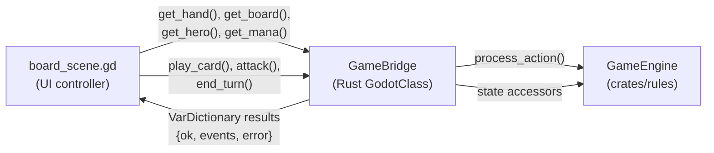
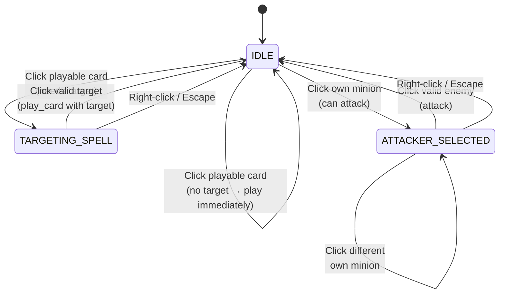
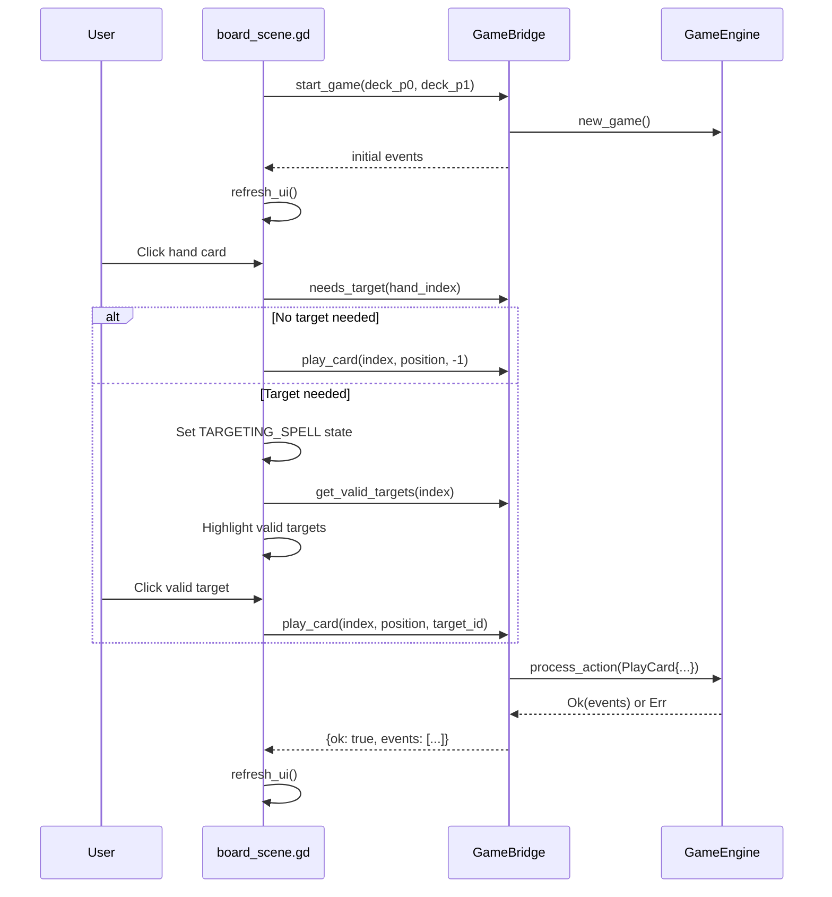
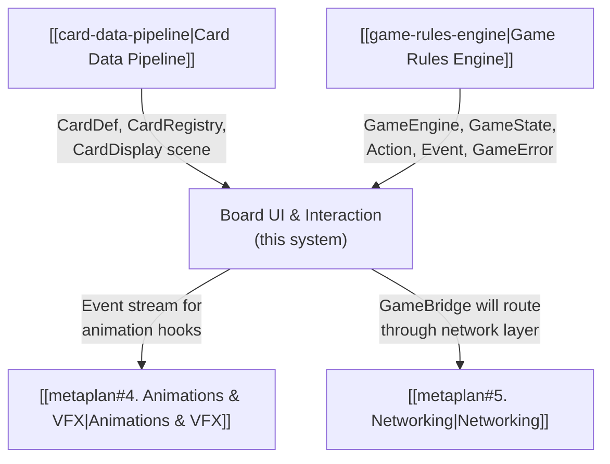

# Board UI & Interaction

> [!info] System Status
> This system is **complete** and verified with a clean bridge build and 87 passing engine tests. See [[metaplan#3. Board UI & Interaction (Godot + GDScript)]] for the original scope.

## Overview

System 3 bridges the pure-Rust game engine ([[game-rules-engine|System 2]]) to a playable Godot board UI. It adds a `GameBridge` GodotClass (analogous to `CardDB` from [[card-data-pipeline|System 1]]) that wraps `GameEngine` with GDScript-callable methods, and a full board scene with click-to-select interaction.

The scope covers: hand display (face-up / face-down), board minion rendering, hero panels, mana display, click-to-select / click-to-target interaction, targeting highlights, error messages, and game-over flow.



## Design Decisions

### State-Snapshot Rendering over Event-Driven Updates

After each action, GDScript calls state accessors (`get_hand`, `get_board`, `get_hero`, `get_mana`) and rebuilds the entire UI. This is simpler than incremental event-driven updates and eliminates desync risk between engine state and UI state.

Events are returned from action calls for logging/debugging and future animation hooks (System 4), but they do not drive the UI.

### GameBridge as a Separate Autoload

`GameBridge` is a standalone autoload (not merged into `CardDB`) because it has a fundamentally different lifecycle — it manages a mutable `GameEngine` instance with per-game state, while `CardDB` is a read-only card registry. Separation keeps both simple and avoids coupling.

### Click-to-Select, Click-to-Target

Rather than drag-and-drop (complex, requires drag preview management), the interaction model uses a state machine:

1. Click a hand card → selects it (or plays it directly if no target is needed)
2. Click a valid target → plays the card with that target
3. Click an own board minion → selects it as attacker
4. Click an enemy minion or hero → executes the attack

Right-click or Escape cancels any selection. This is simpler to implement and works well with both mouse and touch.

### Local Player Is Always the Active Player

`get_hand(active_player)` returns face-up cards (bottom of screen), while `get_hand(opponent)` returns face-down card backs (top of screen). On end turn, the roles swap. This means both P0 and P1 are playable from the same client — you see the active player's perspective each turn.

Networking (System 5) will later introduce a `local_player_id` to fix perspective to a single player.

### EntityId ↔ i64 Casting

Godot's GDScript uses `int` (64-bit signed). The engine uses `EntityId = u64`. The sentinel for Player 1's hero is `u64::MAX`, which becomes `-1` as `i64`. The bridge casts consistently:

```
entity_id_to_i64(eid: u64) -> i64  // u64::MAX → -1
i64_to_entity_id(val: i64) -> u64  // -1 → u64::MAX
```

GDScript uses `-1` for P1's hero entity ID, and `0` for P0's hero.

## Architecture

### Rust Layer

#### Query Methods — `engine.rs`

Four new read-only methods added to `GameEngine` for the bridge to query without mutating state:

| Method | Signature | Purpose |
|--------|-----------|---------|
| `can_entity_attack` | `(&self, player, entity_id) -> Result<(), GameError>` | Checks summoning sickness, attacks exhausted, on-board |
| `valid_attack_targets` | `(&self, player, attacker_id) -> Vec<EntityId>` | Opponent minions + hero, filtered by taunt |
| `is_card_playable` | `(&self, player, hand_index) -> bool` | Mana cost ≤ current mana, board not full for minions |
| `valid_play_targets_for_hand` | `(&self, player, hand_index) -> Option<Vec<EntityId>>` | Delegates to `valid_targets()` for targeted cards; `None` for non-targeted |

These extract validation logic from `handle_attack` and `handle_play_card` into standalone, non-mutating queries.

#### GameBridge — `game_bridge.rs`

`GameBridge` follows the same GodotClass pattern as `CardDatabase`: `#[derive(GodotClass)]`, `#[class(base=Node)]`, `INode` for `init`/`ready`, `#[func]` methods returning `VarDictionary` / `Array<VarDictionary>`.

```rust
#[derive(GodotClass)]
#[class(base=Node)]
pub struct GameBridge {
    engine: Option<GameEngine>,
    registry: Option<Arc<CardRegistry>>,
    base: Base<Node>,
}
```

**Action methods** (mutate state, return `{ "ok": bool, "events": [...], "error": "..." }`):

| Method | GDScript Signature | Notes |
|--------|--------------------|-------|
| `start_game` | `(deck_p0: Array[String], deck_p1: Array[String]) -> Array[Dictionary]` | Loads own `CardRegistry`, creates `GameEngine::new_game()` with `thread_rng()`, returns initial events |
| `play_card` | `(hand_index: int, position: int, target: int) -> Dictionary` | `target = -1` means `None`. Active player inferred. |
| `attack` | `(attacker_id: int, defender_id: int) -> Dictionary` | Casts `i64 → EntityId` internally |
| `end_turn` | `() -> Dictionary` | Sends `EndTurn` for active player |

**State accessors** (read-only):

| Method | Return Type | Notes |
|--------|-------------|-------|
| `get_hand(player)` | `Array[Dictionary]` | Face-up for active player (full card data + `playable`); face-down for opponent |
| `get_board(player)` | `Array[Dictionary]` | `entity_id`, `name`, `attack`, `health`, `max_health`, `keywords`, `can_attack`, `summoning_sickness` |
| `get_hero(player)` | `Dictionary` | `hp`, `max_hp`, `armor`, `entity_id`, `weapon` (nested dict or absent) |
| `get_mana(player)` | `Dictionary` | `current`, `max` |
| `get_valid_targets(hand_index)` | `Array[int]` | For targeted spells/battlecries |
| `get_valid_attack_targets(attacker_id)` | `Array[int]` | Filtered by taunt |
| `can_attack(entity_id)` | `bool` | Delegates to `can_entity_attack()` |
| `needs_target(hand_index)` | `bool` | Whether the card requires a target |
| `get_active_player()` | `int` | 0 or 1 |
| `get_turn_number()` | `int` | |
| `is_game_over()` | `bool` | |
| `get_winner()` | `int` | `-1` if none |
| `hero_entity_id(player)` | `int` | P0 → `0`, P1 → `-1` |
| `get_deck_size(player)` | `int` | Cards remaining in deck |

**Event serialization:** All 21 `Event` variants are converted to `VarDictionary` with an `"event"` key (`"card_drawn"`, `"damage_dealt"`, etc.) and variant-specific fields. Uses the same `keyword_str()` / `rarity_str()` helpers as `card_bridge.rs`.

**Error handling:** `GameError` → `Display` string in `"error"` field. Never panics — returns `{ "ok": false, "error": "..." }` with an empty events array.

### GDScript Layer

#### Interaction State Machine — `board_scene.gd`



| State | Visual Feedback | Valid Clicks |
|-------|----------------|-------------|
| `IDLE` | Playable cards highlighted green, attackable minions glowing | Hand card → select/play; own minion → select attacker |
| `CARD_SELECTED` | Selected card raised, yellow border | Board area → play minion at position |
| `TARGETING_SPELL` | Selected card highlighted, valid targets pulsing green | Valid target → play with target; right-click → cancel |
| `ATTACKER_SELECTED` | Selected minion yellow, valid attack targets green | Enemy minion/hero → attack; right-click → cancel |

#### Core UI Flow



#### Scene Hierarchy

```
BoardScene (Control)
├── Background (ColorRect)
├── OpponentArea (VBoxContainer)
│   ├── OpponentTopRow (HBoxContainer)
│   │   └── OpponentHero (HeroPanel)
│   ├── OpponentHand (HBoxContainer) ← FaceDownCard instances
│   └── OpponentBoard (HBoxContainer) ← BoardMinion instances
├── CenterRow (HBoxContainer)
│   ├── TurnLabel
│   └── EndTurnButton
├── PlayerArea (VBoxContainer)
│   ├── PlayerBoard (HBoxContainer) ← BoardMinion instances
│   ├── PlayerHand (HBoxContainer) ← HandCard instances
│   └── PlayerBottomRow (HBoxContainer)
│       ├── PlayerHero (HeroPanel)
│       └── ManaLabel
├── StatusLabel ← error messages with auto-fade
├── GameOverPanel ← winner announcement + restart button
└── DebugPanel ← deck sizes
```

### Sub-Scenes

| Scene | Script | Size | Purpose |
|-------|--------|------|---------|
| `hero_panel.tscn` | `hero_panel.gd` | 200×80 | HP/Armor/Weapon display, click signal |
| `board_minion.tscn` | `board_minion.gd` | 90×110 | Name, attack/health, keywords, taunt border, sickness overlay |
| `hand_card.tscn` | `hand_card.gd` | 140×196 | Embeds `card_display.tscn` at 70% scale, unplayable overlay, hover-to-enlarge |
| `face_down_card.tscn` | `face_down_card.gd` | 60×84 | Blue card back, no interactivity |

Each sub-scene emits a click signal (`hero_clicked`, `minion_clicked`, `hand_card_clicked`) that the board scene's state machine handles.

## File Inventory

New Rust files:

| File | Role |
|------|------|
| `crates/gdext-bridge/src/game_bridge.rs` | GameBridge GodotClass — 17 `#[func]` methods, event serialization |

Modified Rust files:

| File | Changes |
|------|---------|
| `crates/rules/src/engine.rs` | Added 4 query methods (`can_entity_attack`, `valid_attack_targets`, `is_card_playable`, `valid_play_targets_for_hand`) |
| `crates/gdext-bridge/src/lib.rs` | Added `mod game_bridge;` |
| `crates/gdext-bridge/Cargo.toml` | Added `rand = "0.8"` dependency |

New Godot scenes:

| File | Purpose |
|------|---------|
| `godot/scenes/board/game_bridge.tscn` | GameBridge autoload (single node) |
| `godot/scenes/board/board_scene.tscn` | Main board layout — all areas composed |
| `godot/scenes/board/hero_panel.tscn` | Hero HP/armor/weapon panel |
| `godot/scenes/board/board_minion.tscn` | Board minion display |
| `godot/scenes/board/hand_card.tscn` | Hand card (wraps card_display at 70%) |
| `godot/scenes/board/face_down_card.tscn` | Opponent card back |

New GDScript files:

| File | Purpose |
|------|---------|
| `godot/scripts/board/board_scene.gd` | Main controller: state machine, rendering, input, game lifecycle |
| `godot/scripts/board/hero_panel.gd` | Hero display + click signal |
| `godot/scripts/board/board_minion.gd` | Minion display with keyword indicators + click signal |
| `godot/scripts/board/hand_card.gd` | Hand card display with hover and playability + click signal |
| `godot/scripts/board/face_down_card.gd` | Card back display |

Modified config:

| File | Changes |
|------|---------|
| `godot/project.godot` | Added `GameBridge` autoload, changed main scene to `board_scene.tscn` |

## Test Deck

Only 5 card definitions exist in `data/cards/`. The test deck uses repeated IDs to reach 30 cards:

```gdscript
# 10× Boulderfist Ogre (6 mana, 6/7)
# 10× Sen'jin Shieldmasta (4 mana, 3/5, Taunt)
# 10× Fireball (4 mana, deal 6 damage — targeted spell)
```

This exercises minion play, combat, taunt, targeted spells, and mana management.

## Gotchas

> [!note] EntityId u64 ↔ i64 casting
> `u64::MAX` (P1 hero sentinel) becomes `-1` as `i64`. The bridge casts consistently via `entity_id_to_i64` / `i64_to_entity_id`. GDScript always uses `-1` for P1's hero.

> [!note] CardRegistry sharing
> `GameBridge` loads its own `CardRegistry` on `start_game()` (same path logic as `CardDatabase`). Simple, no coupling between the two autoloads.

> [!note] Board position
> Cards are always appended to the end of the board (`position = board.size()`). A future polish pass could add gap-click position selection between existing minions.

> [!note] Non-targeted cards with empty targets
> When a targeted card has no valid targets, it can be played without a target. The engine already handles this (allows `target=None` when `valid_targets()` returns an empty list).

## Dependencies on Other Systems



- **Card Data Pipeline** provides `CardRegistry` (loaded by `GameBridge`) and `card_display.tscn` (embedded in `hand_card.tscn`)
- **Game Rules Engine** provides `GameEngine` and all its types — `GameBridge` wraps it as a GodotClass
- **Animations** (System 4) will consume the event arrays returned by action methods to play visual effects
- **Networking** (System 5) will replace `GameBridge`'s local engine with a network client that sends actions to an authoritative server
