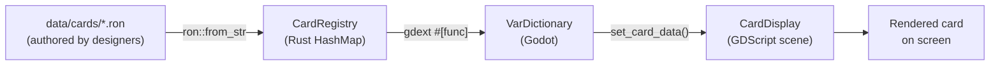
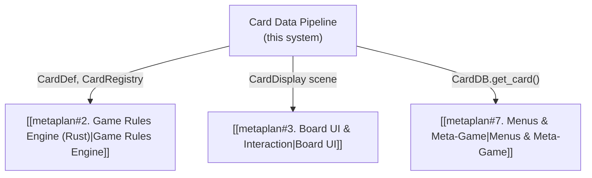

# Card Data Pipeline

> [!info] System Status
> This system is **complete** and verified end-to-end. See [[metaplan#1. Card Data Pipeline]] for the original scope.

## Overview

The card data pipeline defines how cards are **authored**, **loaded**, **validated**, and **rendered**. It is the foundation every other system depends on — the [[metaplan#2. Game Rules Engine (Rust)|rules engine]] consumes card definitions, and the [[metaplan#3. Board UI & Interaction|board UI]] renders them.



## Design Decisions

### RON over JSON

Card definitions use **RON** (Rusty Object Notation) instead of JSON:

- Native Rust enum support — `Minion(MinionStats(attack: 6, health: 7))` works directly
- Comments allowed (`//`) — designers can annotate balance reasoning
- Trailing commas — less friction when editing lists
- Struct names are self-documenting

### One file per card set

Cards are grouped into set files (e.g., `basic_minions.ron`, `basic_spells.ron`). The loader globs all `*.ron` files in `data/cards/` and merges them into one registry. This balances browsability vs. file count.

### Tagged enum for card types

`CardTypeData` is a Rust tagged enum rather than optional fields:

- A **Minion** *must* have `attack` and `health`
- A **Weapon** *must* have `attack` and `durability`
- A **Spell** has neither

The compiler and serde enforce this at deserialization time.

### Dictionary bridge

The gdext bridge returns card data as Godot `VarDictionary` — the most natural format for GDScript consumption. One call gets all fields; no chatty getter methods.

## Architecture

### Rust Layer (`crates/rules`)

> [!note] Pure Rust — no Godot dependency
> This crate is independently testable and will be reused by the [[metaplan#5. Networking|server binary]].

#### Card Data Types — `crates/rules/src/card.rs`

| Type | Purpose |
|------|---------|
| `CardId` | `String` alias — unique card definition identifier |
| `CardDef` | Complete card definition (id, name, cost, type, rarity, keywords, text, art, effects) |
| `CardSet` | Named collection of `CardDef`s — maps to one `.ron` file |
| `CardTypeData` | Tagged enum: `Minion(MinionStats)`, `Spell`, `Weapon(WeaponStats)` |
| `Keyword` | Enum: `Battlecry`, `Deathrattle`, `Taunt`, `Charge`, `DivineShield` |
| `Rarity` | Enum: `Free`, `Common`, `Rare`, `Epic`, `Legendary` |
| `EffectTag` | Opaque `String` wrapper — placeholder for future [[metaplan#2. Game Rules Engine (Rust)|effect system]] |

#### Card Loader — `crates/rules/src/card_loader.rs`

| Component | Purpose |
|-----------|---------|
| `CardRegistry` | `HashMap<CardId, CardDef>` — central lookup for all loaded cards |
| `load_from_directory(path)` | Globs `*.ron`, deserializes each as `CardSet`, merges, validates |
| `CardLoadError` | Error enum via `thiserror`: IO, parse (with line/col), duplicate ID, validation |

Validation rules:
- Card ID must not be empty
- Card name must not be empty
- Duplicate IDs across files are rejected

### Bridge Layer (`crates/gdext-bridge`)

#### CardDatabase — `crates/gdext-bridge/src/card_bridge.rs`

A `GodotClass` extending `Node`, registered as autoload (`CardDB`):

| Method | Signature | Purpose |
|--------|-----------|---------|
| `load_cards` | `(path: GString)` | Load cards from a specific directory |
| `reload_cards` | `()` | Re-read all card files (hot-reload, bound to F5) |
| `get_card` | `(id: GString) -> VarDictionary` | Get one card's data as a dictionary |
| `get_all_card_ids` | `() -> Array<GString>` | List all loaded card IDs |
| `get_card_count` | `() -> i64` | Total number of loaded cards |

### Godot Layer

#### Card Display Scene — `godot/scenes/card/card_display.tscn`

```
CardRoot (Control, 200×280)
├── CardFrame (TextureRect) ← frame texture selected by card_type
├── Artwork (TextureRect) ← loaded from art filename, fallback to placeholder
├── ManaCost (Label) ← top-left
├── CardName (Label) ← center banner
├── CardText (RichTextLabel) ← BBCode for bold keywords
├── AttackIcon (Control) ← bottom-left, hidden for spells
│   └── AttackLabel (Label)
├── HealthIcon (Control) ← bottom-right, hidden for spells
│   └── HealthLabel (Label)
└── RarityGem (TextureRect) ← color-modulated by rarity
```

#### Card Display Script — `godot/scripts/card/card_display.gd`

`set_card_data(data: Dictionary)` populates all visual elements:
- Selects frame texture by `card_type` (minion/spell/weapon)
- Hides attack/health for spells
- Bolds keywords in card text via BBCode
- Sets rarity gem color (white → common, blue → rare, purple → epic, orange → legendary)
- Falls back to `placeholder.png` if card art file is missing

## File Inventory

### Rust

| File | Role |
|------|------|
| `Cargo.toml` | Workspace root |
| `crates/rules/Cargo.toml` | Rules crate — deps: `serde`, `ron`, `thiserror` |
| `crates/rules/src/lib.rs` | Module declarations + re-exports |
| `crates/rules/src/card.rs` | Card data types + 6 unit tests |
| `crates/rules/src/card_loader.rs` | CardRegistry + 11 unit tests (incl. integration test) |
| `crates/gdext-bridge/Cargo.toml` | Bridge crate — deps: `godot`, `hs-rules` |
| `crates/gdext-bridge/src/lib.rs` | GDExtension entry point |
| `crates/gdext-bridge/src/card_bridge.rs` | CardDatabase GodotClass |

### Card Data

| File | Contents |
|------|----------|
| `data/cards/basic_minions.ron` | 3 cards: Boulderfist Ogre, Sen'jin Shieldmasta, Leeroy Jenkins |
| `data/cards/basic_spells.ron` | 1 card: Fireball |

### Godot

| File | Role |
|------|------|
| `godot/project.godot` | Project config, CardDB autoload |
| `godot/hearthstone.gdextension` | Points to compiled Rust dylib |
| `godot/scenes/card/card_database.tscn` | CardDatabase autoload scene |
| `godot/scenes/card/card_display.tscn` | Card rendering scene |
| `godot/scenes/card/card_test.tscn` | Test scene — displays all cards |
| `godot/scripts/card/card_display.gd` | Card rendering script |
| `godot/scripts/card/card_test.gd` | Test harness — F5 to hot-reload |
| `godot/assets/art/cards/placeholder.png` | Fallback card art |
| `godot/assets/art/frames/*.png` | Frame textures (minion/spell/weapon) |

## Test Coverage

> [!success] 17 tests, all passing

| Module | Tests | What's covered |
|--------|-------|----------------|
| `card.rs` | 6 | RON deserialization for minion, spell, weapon; keywords; multiple keywords; CardSet |
| `card_loader.rs` | 11 | Empty dir, single file, multi-file merge, duplicate ID, empty ID, empty name, non-RON ignored, malformed RON, nonexistent card, `ids()`, integration against real data files |

Run with:

```bash
cargo test -p hs-rules
```

## Adding New Cards

To add a card, create or edit a `.ron` file in `data/cards/`:

```ron
// data/cards/my_set.ron
CardSet(
    name: "My Set",
    cards: [
        CardDef(
            id: "my_new_card",
            name: "New Card",
            mana_cost: 3,
            card_type: Minion(MinionStats(attack: 3, health: 4)),
            rarity: Common,
            keywords: [Taunt],
            text: "Taunt",
            art: "new_card.png",
        ),
    ],
)
```

Press **F5** in the running game to hot-reload without restarting.

## Dependencies on Other Systems



- The **rules engine** will consume `CardDef` and `EffectTag` to resolve game mechanics
- The **board UI** will instantiate `CardDisplay` scenes for cards in hand and on the board
- The **menus** (collection viewer, deck builder) will query `CardDB` to display owned cards
