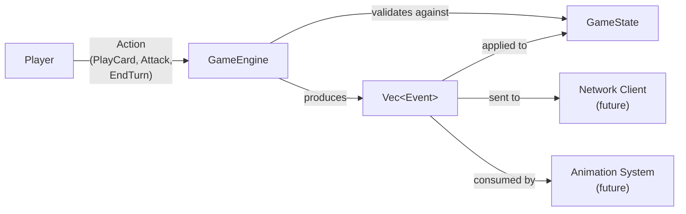
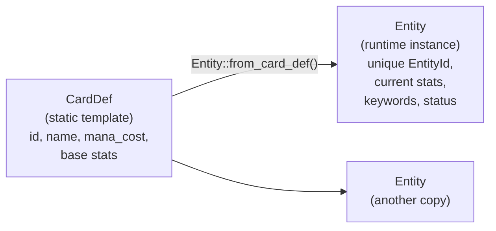
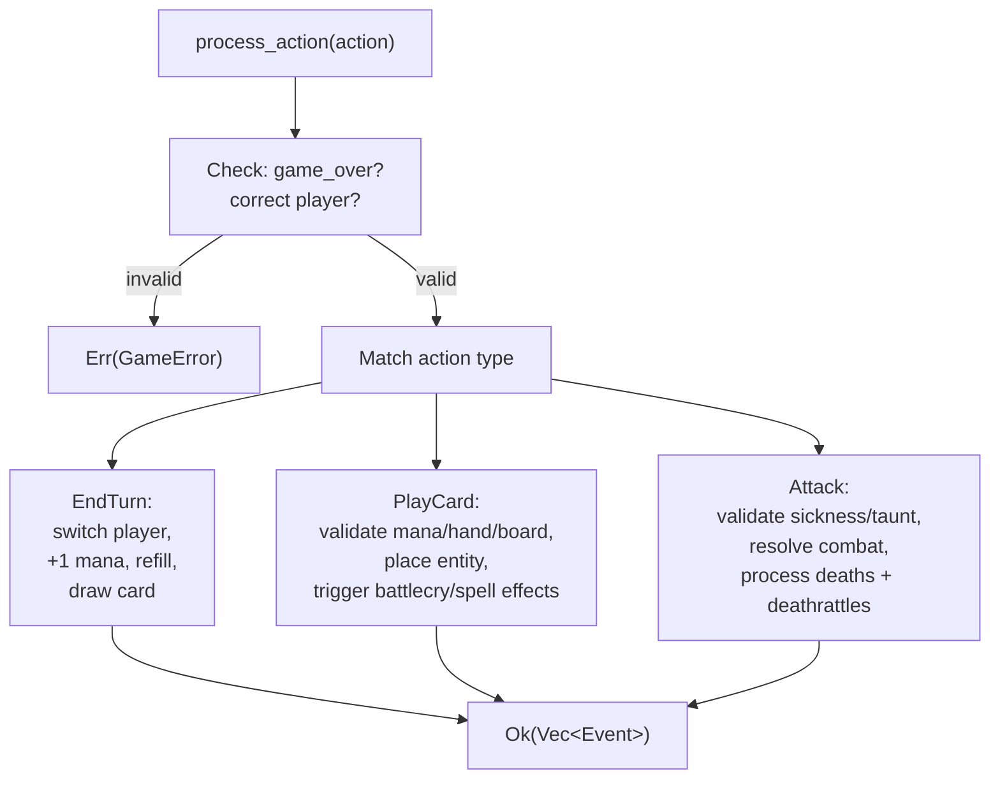
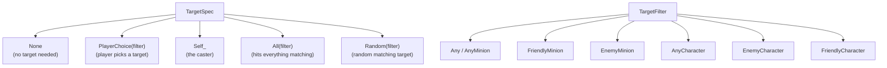
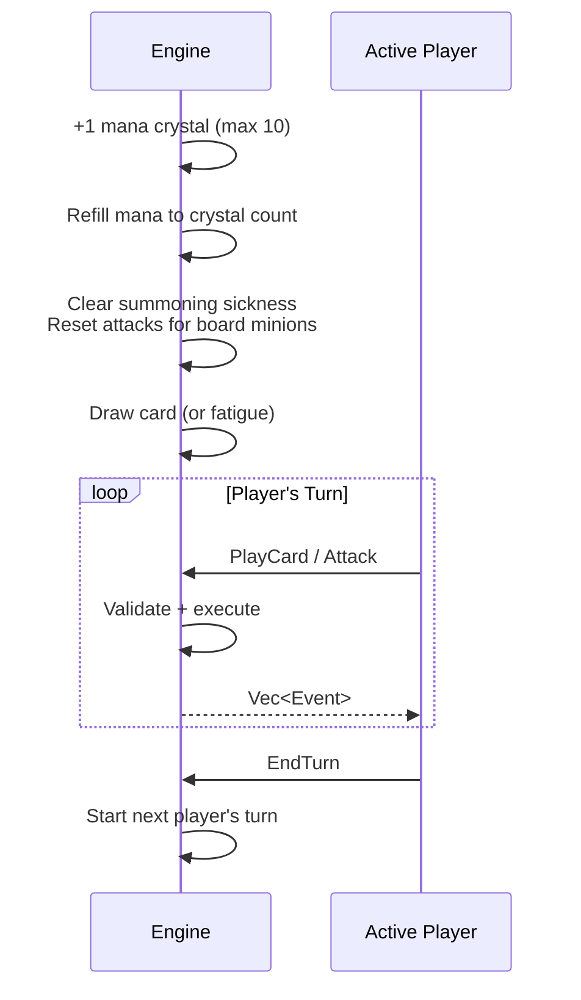
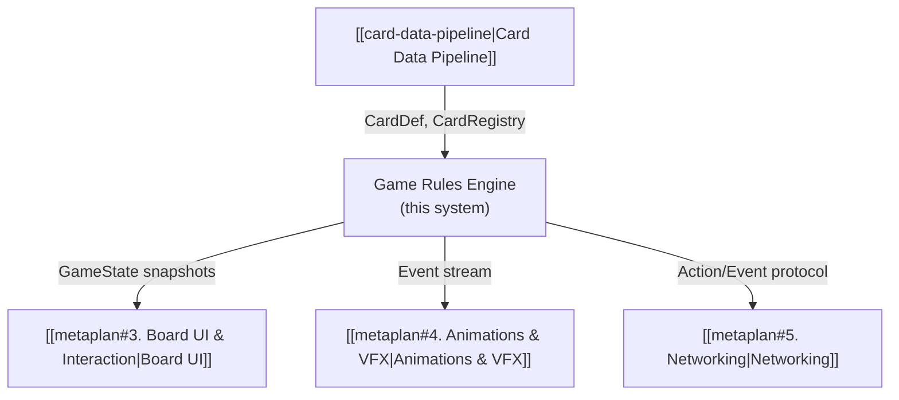

# Game Rules Engine

> [!info] System Status
> This system is **complete** and verified with 76 passing tests. See [[metaplan#2. Game Rules Engine (Rust)]] for the original scope.

## Overview

The game rules engine is the core of the project — it runs actual Hearthstone games. It consumes card definitions from [[card-data-pipeline|System 1]] and implements turn flow, card play, combat, keywords, and effects. It is the **hardest system** in the project (per [[metaplan#Biggest Risks]]).

The engine uses **action/event sourcing**: players submit `Action`s (intents), the engine validates them and produces `Event` sequences (atomic state mutations). This architecture directly enables networking (send events over the wire), animation (each event maps to a visual), replay (re-apply events), and testability (assert on event sequences).



## Design Decisions

### Action/Event Sourcing over Direct Mutation

Every state change is expressed as an `Event`. The engine never silently mutates state — it always produces events that describe *what happened*. This makes the system:

- **Debuggable** — log the event stream to understand any game state
- **Networkable** — serialize events to sync clients
- **Animatable** — each event maps 1:1 to a visual effect
- **Replayable** — store events to reconstruct any game

### Entity vs. CardDef Separation

Runtime card instances (`Entity`) are separate from static card templates (`CardDef`):



- `CardDef` is immutable, shared across all copies of a card, lives in `CardRegistry`
- `Entity` is mutable, has a unique `EntityId`, tracks current attack/health/keywords/summoning sickness
- Multiple entities can reference the same `CardDef` (e.g., two copies of Fireball in a deck)

### Injectable RNG

`GameEngine` takes a `Box<dyn RngCore>` at construction. Tests use a seeded `StdRng` for deterministic results; production can use `thread_rng()`. This makes deck shuffling, random targeting, and draw order fully reproducible in tests.

### Zone-based State

`GameState` tracks card locations via zone vectors (`deck`, `hand`, `board`, `graveyard`) that hold `EntityId` references. The actual `Entity` data lives in a central `HashMap<EntityId, Entity>`. This avoids copying entity data when cards move between zones.

### Depth-limited Effect Recursion

Effects (particularly deathrattles) can chain — a dying minion triggers a deathrattle that kills another minion, which triggers *its* deathrattle. To prevent infinite loops, effect execution is depth-limited to 20 levels.

## Architecture

### Data Model

#### Core Types — `types.rs`

| Type | Definition | Purpose |
|------|-----------|---------|
| `EntityId` | `u64` | Unique identifier for each runtime card instance |
| `PlayerId` | `usize` (0 or 1) | Identifies which player |
| `MAX_HAND_SIZE` | `10` | Cards beyond this are burned on draw |
| `MAX_BOARD_SIZE` | `7` | Maximum minions per player |
| `MAX_MANA` | `10` | Mana crystal cap |
| `STARTING_HP` | `30` | Hero starting health |

#### Entity — `entity.rs`

| Type | Fields | Purpose |
|------|--------|---------|
| `Entity` | `id`, `card_id`, `owner`, `data` | Runtime card instance |
| `MinionEntity` | `attack`, `health`, `max_health`, `keywords`, `summoning_sickness`, `attacks_this_turn` | Mutable minion state |
| `WeaponEntity` | `attack`, `durability` | Weapon state |
| `EntityData` | enum: `Minion`, `Spell`, `Weapon` | Type-specific runtime data |

#### Game State — `game_state.rs`

| Type | Fields | Purpose |
|------|--------|---------|
| `GameState` | `players[2]`, `entities`, `active_player`, `turn_number`, `game_over`, `winner` | Complete game snapshot |
| `Player` | `hero`, `mana_crystals`, `mana`, `deck`, `hand`, `board`, `graveyard`, `weapon`, `fatigue_counter` | Per-player state |
| `Hero` | `hp`, `max_hp`, `armor` | Hero vitals |

### Action/Event Enums

#### Actions — `action.rs`

| Variant | Fields | Meaning |
|---------|--------|---------|
| `EndTurn` | `player` | Player ends their turn |
| `PlayCard` | `player`, `hand_index`, `position`, `target` | Play a card from hand |
| `Attack` | `player`, `attacker`, `defender` | Minion (or hero with weapon) attacks |

#### Events — `event.rs`

| Category | Events |
|----------|--------|
| Game flow | `GameStarted`, `TurnStarted`, `TurnEnded`, `GameOver` |
| Resources | `ManaGained`, `ManaRefilled`, `ManaSpent` |
| Cards | `CardDrawn`, `CardBurned`, `CardPlayed`, `SpellCast` |
| Board | `MinionSummoned`, `MinionDied`, `WeaponEquipped`, `WeaponDestroyed` |
| Combat | `AttackPerformed`, `DamageDealt`, `HeroDamaged`, `HeroDied` |
| Keywords | `DivineShieldPopped` |
| Fatigue | `FatigueDamage` |

#### Errors — `error.rs`

15 error variants covering: wrong turn, game over, mana, board full, hand index, summoning sickness, attack exhaustion, taunt enforcement, targeting, and own-minion attacks.

### Engine — `engine.rs`

`GameEngine` is the central orchestrator:

```rust
pub struct GameEngine {
    pub state: GameState,
    registry: Arc<CardRegistry>,  // shared, immutable card definitions
    rng: Box<dyn RngCore>,        // injectable for deterministic tests
}
```

Key methods:

| Method | Purpose |
|--------|---------|
| `new_game(registry, deck_p0, deck_p1, rng)` | Create game: build entities, shuffle decks, draw starting hands (3/4), start turn 1 |
| `process_action(action)` | Validate and execute an action, return events |
| `state()` | Borrow the current game state |

Internal flow for `process_action`:



### Effect System — `effect.rs` + `effect_exec.rs`

#### Effect Enum

Six effect types, each serializable in RON for card definitions:

| Effect | Fields | Example Card |
|--------|--------|-------------|
| `DealDamage` | `amount`, `target` | Fireball (6 damage to enemy character) |
| `Heal` | `amount`, `target` | Healing Touch (8 to any character) |
| `Summon` | `card_id`, `count`, `for_opponent` | Leeroy Jenkins (2 Whelps for opponent) |
| `DrawCards` | `count` | Arcane Intellect (draw 2) |
| `BuffMinion` | `attack`, `health`, `target` | Blessing of Kings (+4/+4) |
| `DestroyMinion` | `target` | Assassinate (destroy a minion) |

#### Targeting



`TargetSpec::PlayerChoice(filter)` means the player must choose a valid target when playing the card. The engine validates the choice against `valid_targets()`.

#### Trigger Points

| Trigger | When | Condition |
|---------|------|-----------|
| **Battlecry** | After minion placed on board from hand | Card has `Keyword::Battlecry` |
| **Deathrattle** | After minion dies (health <= 0, removed from board) | Card has `Keyword::Deathrattle` |
| **Spell effect** | After spell is cast | Card has effects and is a spell |

> [!note] Battlecry vs. Summon distinction
> Battlecry effects only trigger when a minion is **played from hand**. Minions summoned by effects (e.g., Leeroy's Whelps) do **not** trigger their battlecries. This matches Hearthstone's rules.

## Game Flow

### Turn Structure



### Combat Resolution

1. Validate attacker (on board, not summoning sick, hasn't attacked this turn)
2. Taunt check: if opponent has taunt minions, defender must be one of them
3. Resolve damage:
   - **Minion vs. Minion**: simultaneous mutual damage (Divine Shield absorbs first hit)
   - **Minion vs. Hero**: one-way damage to hero
4. Process deaths: remove dead minions from board to graveyard
5. Trigger deathrattles (with depth limit)

### Starting a Game

1. Create entities from both deck lists (30 cards each)
2. Shuffle both decks (deterministic with provided RNG)
3. Draw starting hands: Player 0 gets 3 cards, Player 1 gets 4
4. Start turn 1 for Player 0 (+1 mana, refill, draw)

### Win Conditions

- Hero reaches 0 HP (from combat, fatigue, or effects) → opponent wins
- Fatigue: drawing from empty deck deals incrementing damage (1, 2, 3, ...)

## Keyword Mechanics

| Keyword | Effect | Implementation |
|---------|--------|---------------|
| **Taunt** | Opponent must attack this minion before others or the hero | Enforced in `handle_attack` — builds list of taunt minions and rejects invalid targets |
| **Charge** | Can attack the turn it's played (ignores summoning sickness) | Checked alongside `summoning_sickness` flag |
| **Divine Shield** | Absorbs the first instance of damage, then is removed | Checked before damage application; emits `DivineShieldPopped` event |
| **Battlecry** | Triggers effects when played from hand | Checked after minion is placed on board |
| **Deathrattle** | Triggers effects when the minion dies | Checked in `process_deaths_with_deathrattles` |

## File Inventory

| File | Role | Tests |
|------|------|-------|
| `crates/rules/src/types.rs` | Core type aliases and constants | — |
| `crates/rules/src/entity.rs` | Runtime card instances | — |
| `crates/rules/src/game_state.rs` | Complete game state snapshot | — |
| `crates/rules/src/action.rs` | Player action enum | — |
| `crates/rules/src/event.rs` | Game event enum (25 variants) | — |
| `crates/rules/src/error.rs` | Error enum (15 variants) | — |
| `crates/rules/src/engine.rs` | Central game orchestrator | 59 tests |
| `crates/rules/src/effect.rs` | Effect types and targeting | — |
| `crates/rules/src/effect_exec.rs` | Effect execution and deathrattle processing | — |
| `data/cards/tokens.ron` | Token card definitions (Whelp) | — |

Modified existing files:

| File | Changes |
|------|---------|
| `crates/rules/src/card.rs` | `EffectTag(String)` replaced with `Vec<Effect>` |
| `crates/rules/src/lib.rs` | New module declarations + re-exports |
| `crates/rules/Cargo.toml` | Added `rand 0.8` dependency |
| `data/cards/basic_minions.ron` | Updated effects from `EffectTag` to `Effect` syntax |
| `data/cards/basic_spells.ron` | Updated effects from `EffectTag` to `Effect` syntax |

## Test Coverage

> [!success] 76 tests, all passing

| Phase | Tests | What's covered |
|-------|-------|---------------|
| Core State & Turns | 14 | Game init (HP, mana, decks), starting hands (3/4), deterministic shuffle, mana gain/cap/refill, draw, card burn, fatigue, game over, turn switching, wrong-turn rejection, event sequence |
| Playing Cards | 12 | Hand-to-board, mana deduction, not-enough-mana, board full, summoning sickness, position insertion, spells, weapon equip/replace, invalid index, event sequence, multi-card turns |
| Combat | 12 | Mutual damage, hero attacks, summoning sickness, attack exhaustion, attack reset, hero death, own-minion rejection, graveyard |
| Keywords | 9 | Taunt enforcement (single/multiple/after death), Charge immediate attack, Divine Shield absorb + removal |
| Effects | 15 | DealDamage (minion + hero), targeting (required/invalid), Battlecry trigger, Battlecry not on summon, Deathrattle on death, deathrattle chain, Heal (restore + cap), Buff, DrawCards, DestroyMinion, Summon (board limit), depth limit |
| Integration | 1 | Multi-turn game: draw, play, attack, kill hero, game over with correct winner |
| Card data (System 1) | 13 | RON deserialization, loader validation, integration against data files |

Run with:

```bash
cargo test -p hs-rules
```

## RON Effect Syntax

Effects are now first-class RON values instead of opaque strings. Examples:

```ron
// Fireball — targeted damage
effects: [DealDamage(amount: 6, target: PlayerChoice(EnemyCharacter))]

// Leeroy Jenkins — summon for opponent
effects: [Summon(card_id: "token_whelp", count: 2, for_opponent: true)]

// Arcane Intellect — draw cards
effects: [DrawCards(count: 2)]

// Healing Touch — targeted heal
effects: [Heal(amount: 8, target: PlayerChoice(AnyCharacter))]

// Blessing of Kings — targeted buff
effects: [BuffMinion(attack: 4, health: 4, target: PlayerChoice(FriendlyMinion))]

// Assassinate — targeted destroy
effects: [DestroyMinion(target: PlayerChoice(AnyMinion))]
```

## Dependencies on Other Systems



- **Card Data Pipeline** provides `CardDef` and `CardRegistry` that the engine consumes
- **Board UI** will read `GameState` to render the current board, hands, hero HP, mana
- **Animations** will consume the `Event` stream — each event maps to a visual (e.g., `DamageDealt` triggers a damage number, `MinionDied` triggers a death animation)
- **Networking** will serialize `Action`s from clients and broadcast `Event` sequences from the authoritative server (which runs the same `GameEngine`)
