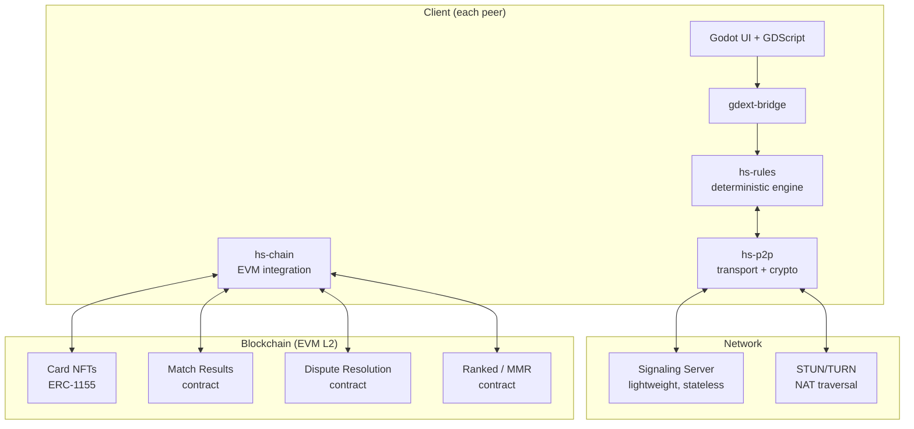
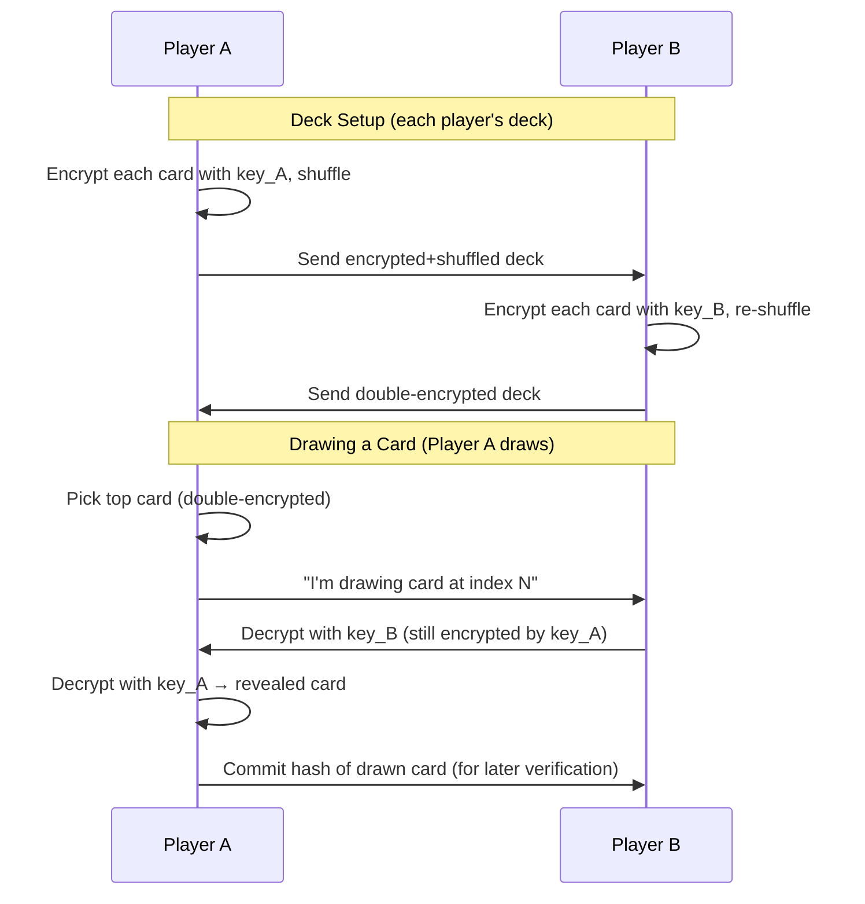
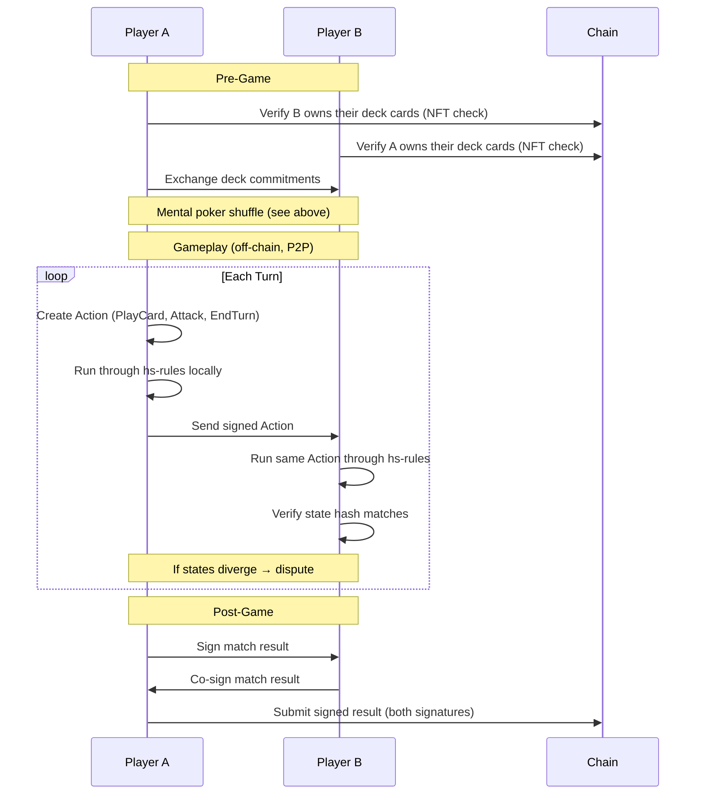

# System 5: Networking — Hybrid P2P Architecture

> **Model:** Gods Unchained-inspired hybrid — P2P gameplay off-chain, assets and results on-chain (EVM L2)
> **Key difference from Hearthstone:** No authoritative game server. Both peers run `hs-rules` independently and exchange signed actions.

---

## Architecture Overview



---

## The Mental Poker Problem

In P2P, there is no trusted server to manage hidden information (deck order, hands). The **Mental Poker Protocol** solves this using commutative encryption — neither player can see cards until both encryption layers are removed.

Three categories of hidden info:

- **Opponent's hand** — they know, you don't
- **Your own deck order** — neither player should know what they'll draw next
- **Opponent's deck order** — same

### Commutative Encryption Shuffle

Uses elliptic curve point masking (e.g., Ristretto255 via `curve25519-dalek`):



This will be implemented as a standalone Rust crate first: [[mental-poker-protocol]].

---

## Game Protocol Flow



---

## Cheating Prevention & Dispute Resolution

Both peers run `hs-rules` independently. Cheating is handled by cryptographic commitments and on-chain arbitration.

| Threat | Mitigation |
|--------|-----------|
| Fabricated actions | Every action is signed; opponent validates via `hs-rules` |
| State manipulation | State hash exchanged each turn; divergence = dispute |
| Deck stacking | Mental poker shuffle — neither player controls order |
| Card fabrication | Deck list committed at start, verified against on-chain NFTs |
| Abandonment / rage-quit | Timeout → opponent submits signed action log to chain for auto-win |
| State divergence | Submit full action log to on-chain dispute contract |

### Dispute Resolution Options

- **On-chain replay (trustless):** Smart contract re-executes the action log. Requires game rules in Solidity or WASM (e.g., Arbitrum Stylus compiles Rust to WASM).
- **Optimistic with fraud proofs:** Accept results unless disputed within a time window. Disputed matches get arbitrated by staked arbiters or on-chain WASM execution.

---

## Blockchain Layer

```
On-chain (EVM L2 — Immutable zkEVM, Arbitrum, or Polygon)
├── Card NFTs (ERC-1155) — ownership, trading, minting
├── Deck Registry — commit deck hash, verify ownership
├── Match Results — winner, loser, signed by both
├── MMR / Ranking — updated per match result
└── Dispute Resolution — accepts action logs, adjudicates

Off-chain (P2P)
├── Actual gameplay (Action exchange)
├── Mental poker shuffle
└── State synchronization
```

---

## New Crate Structure

```
crates/
├── rules/            # (existing) — pure game logic, deterministic
├── gdext-bridge/     # (existing) — Godot FFI
├── p2p/              # NEW — networking + crypto
│   ├── transport.rs      # WebRTC data channels (via webrtc-rs)
│   ├── protocol.rs       # Message types, action relay, state sync
│   ├── mental_poker.rs   # Commutative encryption shuffle/draw
│   ├── session.rs        # Game session lifecycle
│   └── signaling.rs      # Signaling client (connect to relay)
├── chain/            # NEW — blockchain interaction
│   ├── nft.rs            # Verify card ownership (ethers-rs / alloy)
│   ├── match_result.rs   # Submit/verify match results
│   ├── dispute.rs        # Submit dispute with action log
│   └── wallet.rs         # Player wallet/signing
└── contracts/        # NEW — Solidity smart contracts
    ├── CardNFT.sol
    ├── MatchResult.sol
    └── DisputeResolution.sol
```

---

## Required Changes to `hs-rules`

The existing crate is well-positioned but needs:

- **Deterministic RNG** — Replace `Box<dyn RngCore>` with a seeded CSPRNG derived from the mental poker protocol (both players derive the same seed for shared randomness)
- **State hashing** — Add `GameState::hash() -> [u8; 32]` for state sync verification
- **Serializable Actions/Events** — Add `serde::Serialize`/`Deserialize` to `Action` and `Event` for wire transport
- **Replay** — `GameEngine::replay(actions: &[Action])` to reconstruct state from action log (for disputes)

---

## Approach Comparison

| Approach | Gameplay | Assets | Complexity |
|----------|----------|--------|-----------|
| GU-actual (server + chain) | Centralized server | On-chain NFTs | Medium |
| **Hybrid P2P (chosen)** | **P2P with mental poker** | **On-chain NFTs + results** | **High** |
| Fully on-chain | All on-chain | All on-chain | Very high, slow |

---

## Implementation Order

1. **Mental poker protocol** — standalone Rust crate, TDD (`~/Projects/mental-poker-rs`)
2. **`crates/p2p`** — transport + protocol, integrates mental poker
3. **`hs-rules` changes** — deterministic RNG, state hashing, serde, replay
4. **`crates/chain`** — EVM integration, NFT verification, match results
5. **Solidity contracts** — card NFTs, match results, dispute resolution
6. **gdext-bridge + UI** — expose P2P session to Godot, matchmaking UI
